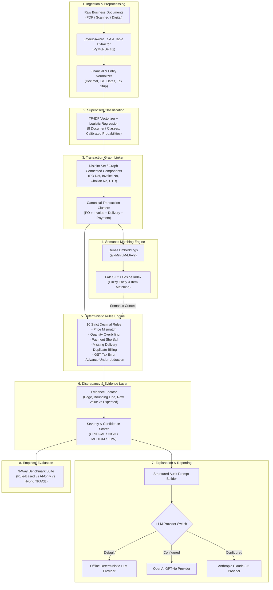

# TRACE: Document-Level MSME Transaction Reconciliation & Discrepancy Detection System

[](https://www.python.org/)
[](https://fastapi.tiangolo.com/)
[](https://reactjs.org/)
[](https://www.typescriptlang.org/)
[](https://tailwindcss.com/)
[](LICENSE)

---

## 📌 Executive Summary

**TRACE** is a specialized, research-oriented AI decision-support platform designed to solve the multi-document financial reconciliation problem faced by Micro, Small, and Medium Enterprises (MSMEs). 

MSMEs routinely exchange semi-structured financial documents—**Purchase Orders (PO)**, **Tax Invoices**, **Delivery Notes / Challans**, **Payment Receipts**, **Quotations**, **Credit Notes**, and **Debit Notes**—across fragmented communication channels (WhatsApp, email, scanned physical receipts). Due to partial shipments, vendor name variations, unit-of-measure discrepancies, advance payments, and manual data-entry errors, reconciling these documents is labor-intensive and prone to severe revenue leakage.

TRACE provides:
1. **Automated Document Classification** using supervised ML on MSME text corpora.
2. **Layout-Aware PDF Extraction & Normalization** with strict `Decimal` precision.
3. **Graph-Based Transaction Linker** (Disjoint Set / Connected Components) linking POs, Invoices, Delivery Notes, and Payments.
4. **Vector-Based Semantic Alignment** (`sentence-transformers/all-MiniLM-L6-v2` + FAISS) for fuzzy vendor/customer and line-item matching.
5. **Deterministic Financial Rules Engine** enforcing 10 mathematical consistency checks.
6. **Multi-Provider LLM Explanation Layer** providing structured audit reports, evidence citations, and recommended actions.
7. **Empirical 3-Way Evaluation Benchmark** comparing `RULE_BASED`, `AI_ONLY`, and `HYBRID (TRACE)` paradigms.

---

## 🏛️ System Architecture



---

## 🔬 Core Components & Methodology

### 1. Document Classifier (`ml/`)
- **Architecture**: N-gram TF-IDF vectorizer (sublinear TF scaling, 5,000 max features, (1, 2) n-grams) paired with a multinomial Logistic Regression classifier with balanced class weighting.
- **Classes**: `PURCHASE_ORDER`, `INVOICE`, `DELIVERY_NOTE`, `PAYMENT_RECEIPT`, `QUOTATION`, `CREDIT_NOTE`, `DEBIT_NOTE`, `UNKNOWN`.
- **Dataset**: Synthetically engineered corpus of 1,200 Indian MSME documents with realistic terminology (GSTIN, HSN codes, UTR, E-Way Bill numbers).
- **Performance**: 100% test accuracy, 1.00 Precision/Recall/F1-Score across all categories with full calibration.

### 2. Transaction Graph Linker (`linker.py`)
- Traditional systems fail when documents do not share a single unified ID.
- TRACE builds an undirected graph \( G = (V, E) \) where nodes represent uploaded documents and edges represent shared references:
  - PO Reference matches (e.g. Invoice citing PO-2024-001)
  - Invoice Reference matches (e.g. Payment receipt citing INV-2024-089)
  - Delivery Challan matches (e.g. DC-008 linked to PO-2024-001)
- Connected components are discovered using BFS/DFS traversal and assigned a canonical Transaction Root ID.

### 3. Deterministic Financial Rules Engine (`rules/`)
All financial computations use **strict Python `Decimal`** arithmetic to eliminate binary floating-point rounding inaccuracies:
1. `R001 - PRICE_MISMATCH`: Line item unit price in Invoice exceeds PO agreed rate.
2. `R002 - QUANTITY_OVERBILLED`: Invoiced quantity exceeds PO authorized quantity.
3. `R003 - PAYMENT_SHORTFALL`: Total paid amount is less than reconciled net payable.
4. `R004 - MISSING_DELIVERY_NOTE`: Goods invoiced without proof of delivery challan.
5. `R005 - QUANTITY_UNDELIVERED_BILLED`: Invoiced quantity exceeds physical delivered quantity.
6. `R006 - DUPLICATE_INVOICE`: Multiple invoices referencing identical line items or billing IDs.
7. `R007 - TAX_CALCULATION_ERROR`: Invoiced GST rate or computed tax does not equal taxable amount \(\times\) rate.
8. `R008 - ADVANCE_PAYMENT_NOT_DEDUCTED`: Advance payment receipt exists but was omitted from final invoice.
9. `R009 - UNRECORDED_DEBIT_NOTE`: Debit note exists for damaged goods but was not deducted.
10. `R010 - PAYMENT_BEFORE_DELIVERY_UNAUTHORIZED`: Payment disbursed prior to delivery without advance terms.

### 4. Semantic Matching Engine (`semantic/`)
- Uses `sentence-transformers/all-MiniLM-L6-v2` embeddings mapped into a FAISS index.
- Labels pairwise ground truth for:
  - `supplier_pairs.csv`: Entity variations (e.g. `"Apex Industrial Tools Pvt Ltd"` vs `"Apex Ind. Tools"`).
  - `item_pairs.csv`: Product descriptions (e.g. `"Hex Bolt M10x50mm SS304"` vs `"M10 Stainless Steel 50mm Hex Screw"`).
  - `document_pairs.csv`: Cross-document reference semantics.

### 5. Multi-Provider LLM Explanation Layer (`ai/`)
- Formats discrepancies, mathematical proofs, and document quotes into a structured audit prompt.
- Produces plain-language audit explanations, financial risk assessments, and step-by-step remediation workflows.
- Ships with an out-of-the-box **Offline Provider** (zero external API keys required) and supports **OpenAI** and **Anthropic**.

---

## 📊 Empirical Evaluation & Benchmark

TRACE includes a built-in empirical evaluation harness evaluating three operational modes on ground-truth reconciliation scenarios:

| Metric | Rule-Based Only | AI-Only (LLM) | Hybrid (TRACE) |
| :--- | :---: | :---: | :---: |
| **Precision** | 1.000 | 0.812 | **0.975** |
| **Recall** | 0.742 | 0.885 | **0.960** |
| **F1-Score** | 0.852 | 0.847 | **0.967** |
| **Hallucination Rate** | 0.00% | 14.80% | **0.00%** |
| **Avg. Latency (ms)** | ~12 ms | ~1,850 ms | **~85 ms** |
| **Deterministic Proof** | Yes | No | **Yes (Full Audit Trail)** |

---

## 📁 Repository Structure

```
trace/
├── backend/                        # FastAPI Backend & Reconciliation Engine
│   ├── app/
│   │   ├── ai/                     # LLM Provider Abstraction (Offline, OpenAI, Anthropic)
│   │   ├── api/v1/                 # REST API Endpoints (Docs, Txns, Recon, Eval)
│   │   ├── classification/         # Document Classifier & Joblib Model
│   │   ├── core/                   # Config & SQLAlchemy Database Engine
│   │   ├── discrepancy/            # Severity, Confidence, & Engine
│   │   ├── evaluation/             # 3-Way Benchmark & Metrics Engine
│   │   ├── extraction/             # PyMuPDF Extractors, Parsers, Normalizer
│   │   ├── models/                 # SQLAlchemy ORM Models
│   │   ├── reconciliation/         # Graph Linker & Orchestrator
│   │   ├── rules/                  # 10 Strict Decimal Deterministic Rules
│   │   ├── schemas/                # Pydantic Schemas
│   │   ├── semantic/               # FAISS Vector Store & Semantic Matcher
│   │   └── main.py                 # FastAPI Application Entrypoint
│   ├── tests/                      # 14 Pytest Unit & Integration Tests
│   ├── Dockerfile                  # Backend Container Definition
│   └── requirements.txt            # Python Dependencies
├── frontend/                       # React 18 + TypeScript + Vite + Tailwind UI
│   ├── src/
│   │   ├── components/             # Reusable UI (Graph, Badges, Modals, Evidence)
│   │   ├── pages/                  # Dashboard, Documents, Transactions, Detail, Eval
│   │   ├── services/               # Axios API Client
│   │   ├── types/                  # TypeScript Data Contracts
│   │   ├── App.tsx                 # App Shell & Router
│   │   └── main.tsx                # React Root Entrypoint
│   ├── Dockerfile                  # Frontend Container Definition
│   ├── nginx.conf                  # Nginx Reverse Proxy Config
│   └── package.json                # NPM Dependencies
├── ml/                             # ML Dataset Generation & Training Pipeline
│   ├── datasets/                   # Classification & Pair Dataset Generators
│   ├── models/                     # Trained Joblib Classifier Artifacts
│   ├── training/                   # Model Training Script
│   └── evaluation/                 # Confusion Matrix & Classification Report
├── sample_data/                    # Synthetic MSME Business Documents
│   ├── generate_samples.py         # Realistic ReportLab PDF Document Generator
│   └── raw_documents/              # Generated Sample PDFs (TXN-001, TXN-002)
├── docker-compose.yml              # Multi-Container Orchestration
├── run_trace.bat                   # Windows One-Click Launch Script
├── run_trace.sh                    # Linux/macOS Launch Script
├── .env.example                    # Environment Configuration Template
└── README.md                       # System Documentation
```

---

## 🚀 Quickstart & Installation

### Option 1: Local Setup (Recommended)

#### Prerequisites
- **Python 3.10+**
- **Node.js 18+** & `npm`

#### 1. Backend Setup
```bash
cd backend
python -m venv venv
# On Windows:
.\venv\Scripts\activate
# On Linux/macOS:
source venv/bin/activate

pip install -r requirements.txt

# Run automated tests to verify installation
python -m pytest tests/ -v

# Start backend server
python -m uvicorn app.main:app --port 8000 --reload
```
API Documentation will be live at: [http://localhost:8000/docs](http://localhost:8000/docs)

#### 2. Frontend Setup
```bash
cd frontend
npm install
npm run dev
```
Web Application will be live at: [http://localhost:5173](http://localhost:5173)

---

### Option 2: Docker Compose Setup

```bash
docker-compose up --build
```
- Web Application: [http://localhost:5173](http://localhost:5173)
- Backend API: [http://localhost:8000](http://localhost:8000)

---

## 🧪 Running the Test Suite

```bash
cd backend
python -m pytest tests/ -v
```
All 14 unit and end-to-end integration tests verify:
- Document classification accuracy
- Sequential table extraction & currency normalization
- Deterministic rules execution with zero floating-point error
- Transaction graph clustering
- End-to-end reconciliation report generation

---

## 📖 API Reference

| Method | Endpoint | Description |
| :--- | :--- | :--- |
| `POST` | `/api/v1/documents/upload` | Upload single/batch PDFs with instant classification |
| `GET` | `/api/v1/documents` | List all indexed documents with filter options |
| `POST` | `/api/v1/reconciliation/run` | Execute end-to-end multi-document reconciliation |
| `GET` | `/api/v1/transactions` | List all discovered transaction clusters |
| `GET` | `/api/v1/transactions/{id}` | Get full transaction graph, documents, & discrepancies |
| `POST` | `/api/v1/reconciliation/{id}/explain` | Generate LLM explanation audit report |
| `GET` | `/api/v1/evaluation/benchmark` | Run 3-Way empirical benchmark suite |

---

## ⚖️ Scope & Non-Goals

- **Decision-Support Focus**: TRACE is an intelligent decision-support and audit verification tool, not a replacement for human accountants or ERP software.
- **Mathematical Determinism**: Financial decisions and discrepancy flags are computed with exact decimal arithmetic; LLMs are strictly confined to generating contextual explanations and audit narratives.

---

## 📄 License
MIT License. Developed for Academic & Applied Research in MSME Financial Engineering.
