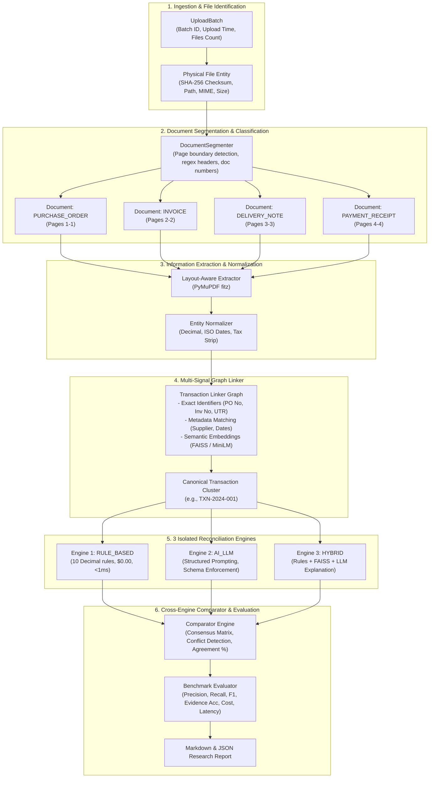

# TRACE — Document-Level MSME Transaction Reconciliation & Discrepancy Detection System

[](https://www.python.org/)
[](https://fastapi.tiangolo.com/)
[](https://reactjs.org/)
[](https://www.typescriptlang.org/)
[](https://tailwindcss.com/)
[](LICENSE)

---

## 🔬 Research Overview & Objective

**TRACE** is a scientific research platform and decision-support system designed to experimentally compare three automated approaches for transaction-level reconciliation across heterogeneous business documents:

1. **`RULE_BASED`**: Pure deterministic financial mathematics using exact Python `Decimal` arithmetic (zero floating-point error, 0 LLM calls, $0.00 cost, <1ms latency).
2. **`AI_LLM`**: Structured prompt reasoning over extracted document contexts with JSON schema enforcement, strict anti-hallucination bounds, and token/cost telemetry.
3. **`HYBRID`**: Synergistic pipeline combining deterministic rules, dense vector semantic similarity (`all-MiniLM-L6-v2` + FAISS), and targeted LLM explanations with discrepancy-level provenance badges (`rule`, `semantic`, `llm`).

### Central Research Question

> _"Which approach—rule-based, AI/LLM-based, or hybrid—provides more reliable and explainable transaction-level reconciliation across heterogeneous business documents?"_

The system **does not presuppose that Hybrid is superior**. Instead, identical transaction datasets are concurrently passed through all three isolated engines, and their outputs are benchmarked against an empirical ground truth dataset across precision, recall, F1, evidence accuracy, latency, and cost.

---

## 🏛️ Core Concept: `FILE != DOCUMENT != TRANSACTION`

Traditional invoice processing systems make the flawed assumption that _one uploaded file equals one transaction_. In practical MSME commerce:

- **Case 1 (1 File $\to$ 1 Document)**: Single-page invoice PDF.
- **Case 2 (1 File $\to$ Multiple Documents)**: A single scanned multi-page PDF containing a Purchase Order, Tax Invoice, Delivery Challan, and Payment Receipt.
- **Case 3 (Multiple Files $\to$ 1 Transaction)**: Separate PDF uploads (`po.pdf`, `invoice.pdf`, `receipt.pdf`) linked by identifiers.
- **Case 4 (Multiple Files $\to$ Multiple Transactions)**: Batch uploads containing paperwork from different vendors and orders.
- **Case 5 (1 Batch $\to$ Multiple Files $\to$ Multiple Transactions)**: Mixed folder drops.
- **Case 6 (1 PDF $\to$ Multiple Invoices)**: Multi-invoice statements bundled into a single file.



---

## 🔬 The 3 Reconciliation Engines

| Feature                | 1. Rule-Based Engine                               | 2. AI / LLM Engine                                 | 3. Hybrid Engine (TRACE)                                                 |
| :--------------------- | :------------------------------------------------- | :------------------------------------------------- | :----------------------------------------------------------------------- |
| **Philosophy**         | Strict deterministic mathematics                   | Semantic context & natural language reasoning      | Deterministic rules + Dense FAISS embeddings + Targeted LLM explanations |
| **Arithmetic**         | Exact Python `Decimal` (zero floating-point error) | LLM numeric parsing (bounded by JSON schema)       | Strict Python `Decimal` validated against vector citations               |
| **Execution Cost**     | **$0.0000**                                        | Token consumption ($0.001 - $0.01 per run)         | Selective token usage (only for explanation synthesis)                   |
| **Latency**            | **< 1.0 ms**                                       | 1,200 - 3,500 ms                                   | 40 - 120 ms (offline) / 800 ms (cloud)                                   |
| **Hallucination Risk** | **0.0%** (deterministic)                           | Non-zero (mitigated by strict context constraints) | **0.0%** for discrepancy facts; bounded narrative                        |
| **Fuzzy Matching**     | Weak (exact token / regex only)                    | Strong (handles misspellings, typos, paraphrasing) | **Strongest** (FAISS dense vector index + cosine similarity)             |
| **Provenance**         | `provenance: "rule"`                               | `provenance: "llm"`                                | Badged per discrepancy: `rule`, `semantic`, or `llm`                     |

---

## 📊 Ground Truth Benchmark & Empirical Evaluation

TRACE features an annotated ground-truth benchmark suite of **40 realistic MSME transaction scenarios** (`data/ground_truth/benchmark_dataset.json`) spanning 12 discrepancy categories:

1. `QUANTITY_MISMATCH`: Invoiced quantity differs from ordered or delivered quantity.
2. `PRICE_MISMATCH`: Billed unit price differs from purchase order contract rate.
3. `TAX_MISMATCH`: Invoiced GST/VAT does not match statutory rates or taxable base.
4. `TOTAL_MISMATCH`: Arithmetic mismatch between line item sums and invoice totals.
5. `PAYMENT_MISMATCH`: Settled amount short of invoiced net payable.
6. `DATE_MISMATCH`: Inconsistent issuance, delivery, or payment milestone dates.
7. `SUPPLIER_MISMATCH`: Discrepant legal entity names or GSTINs across documents.
8. `CUSTOMER_MISMATCH`: Incorrect billing or delivery address / recipient.
9. `ITEM_MISMATCH`: Inconsistent item codes, SKU descriptions, or units of measure.
10. `MISSING_DOCUMENT`: Required supporting document (e.g. proof of delivery) absent.
11. `DUPLICATE_DOCUMENT`: Multiple billings for identical transaction references.
12. `DOCUMENT_LINKING_ERROR`: Erroneously clustered unrelated document units.

### Evaluation Metrics Calculated

For each engine against ground truth:
$$\text{Precision} = \frac{TP}{TP + FP}, \quad \text{Recall} = \frac{TP}{TP + FN}, \quad F_1 = 2 \cdot \frac{\text{Precision} \cdot \text{Recall}}{\text{Precision} + \text{Recall}}$$

- **Evidence Localization Accuracy**: Verification of page numbers, field coordinates, and cited document numbers.
- **Document Linking Accuracy**: Precision of Disjoint Set clustering against ground-truth transaction boundaries.
- **Latency & Compute Cost**: Milliseconds elapsed and API dollar cost per transaction.

---

## 📁 Repository Structure

```
trace/
├── backend/                        # FastAPI Backend & Scientific Engines
│   ├── app/
│   │   ├── ai/                     # LLM Provider Abstraction (Offline, OpenAI, Anthropic)
│   │   ├── api/v1/                 # REST API Endpoints (Docs, Txns, Recon, Eval, Dashboard)
│   │   ├── classification/         # Document Classifier & Joblib Model
│   │   ├── core/                   # Configuration, Database Migrations, & Logging
│   │   ├── evaluation/             # Benchmark Evaluator & Markdown Report Generator
│   │   ├── extraction/             # DocumentSegmenter, PyMuPDF Extractors, Normalizer
│   │   ├── models/                 # SQLAlchemy ORM (UploadBatch, File, Document, Txn, ReconRun)
│   │   ├── reconciliation/         # Multi-Signal Graph Linker & 3 Engines
│   │   │   ├── engines/            # BaseEngine, RuleBasedEngine, AILLMEngine, HybridEngine, Comparator
│   │   │   └── linker.py           # Multi-Signal Transaction Linker Graph
│   │   ├── rules/                  # 10 Strict Decimal Deterministic Rules
│   │   ├── schemas/                # Pydantic Schemas for API contracts
│   │   └── semantic/               # FAISS Vector Store & Semantic Matcher
│   ├── tests/                      # 45 Pytest Unit, Integration, & Pipeline Tests
│   ├── Dockerfile                  # Production Container
│   └── requirements.txt            # Python Dependencies
├── frontend/                       # React 18 + TypeScript + Vite + Tailwind UI
│   ├── src/
│   │   ├── api/                    # Axios API Client with Research Endpoints
│   │   ├── components/             # UI Components (3-Way Matrix, Graph, Evidence Viewer)
│   │   ├── pages/                  # Dashboard, Evaluation, Transactions, Detail, Upload
│   │   └── types/                  # TypeScript Data Contracts
│   ├── package.json                # NPM Dependencies
│   └── vite.config.ts              # Vite Bundler Configuration
├── data/
│   └── ground_truth/               # 40-Transaction Ground Truth Benchmark Dataset & Reports
├── sample_data/                    # Synthetic PDF Generator & Multipage Test PDFs
├── run_trace.bat                   # Windows One-Click Launch Script
├── docker-compose.yml              # Multi-Container Orchestration
└── README.md                       # Research Documentation
```

---

## 🚀 Quickstart & Installation

### Option 1: Local Setup

#### Prerequisites

- **Python 3.10+**
- **Node.js 18+** & `npm`

#### 1. Backend Setup

```bash
cd backend
python -m venv venv

# On Windows:
.\venv\Scripts\activate
# On Linux/macOS:
source venv/bin/activate

pip install -r requirements.txt

# Run the 45-test suite to verify the research pipeline
python -m pytest tests/ -v

# Start backend server
python -m uvicorn app.main:app --port 8000 --reload
```

API Documentation: [http://localhost:8000/docs](http://localhost:8000/docs)

#### 2. Frontend Setup

```bash
cd frontend
npm install
npm run dev
```

Web Application: [http://localhost:5173](http://localhost:5173)

---

### Option 2: Windows One-Click Runner

Double-click `run_trace.bat` in the project root to start both backend and frontend automatically.

---

## 🧪 Running Automated Tests

TRACE includes a comprehensive 45-test automated test suite covering:

- Document segmentation across multi-document and multi-page PDFs
- Multi-signal graph linker clustering
- Deterministic rules execution with `Decimal` precision
- Independent execution of Rule-Based, AI/LLM, and Hybrid engines
- Comparator agreement matrix and conflict detection
- Ground truth benchmark evaluation and metrics calculation
- End-to-end REST API workflows

```bash
cd backend
python -m pytest tests/ -v
```

Expected output:

```text
============================== 45 passed in 2.24s ==============================
```

---

## 📖 Key Research API Endpoints

| Method | Endpoint                                             | Description                                                               |
| :----- | :--------------------------------------------------- | :------------------------------------------------------------------------ |
| `POST` | `/api/v1/documents/upload`                           | Upload single or multi-document files with automatic segmentation         |
| `POST` | `/api/v1/documents/seed-demo`                        | Seed synthetic multi-document transactions for instant testing            |
| `GET`  | `/api/v1/transactions/graph`                         | Fetch graph representation of transactions, linked documents, and methods |
| `POST` | `/api/v1/transactions/{id}/reconcile`                | Run 3-way reconciliation on a single transaction                          |
| `POST` | `/api/v1/reconciliation/compare`                     | Concurrently run Rule-Based, AI/LLM, and Hybrid on a transaction          |
| `GET`  | `/api/v1/reconciliation/transaction/{id}/comparison` | Retrieve latest 3-way comparison matrix for a transaction                 |
| `POST` | `/api/v1/evaluation/run`                             | Execute 40-scenario benchmark across all 3 engines                        |
| `GET`  | `/api/v1/evaluation/results`                         | Retrieve latest benchmark evaluation report and metrics                   |
| `GET`  | `/api/v1/evaluation/export-report`                   | Download scientific evaluation report in Markdown format                  |

---

## ⚖️ Scientific Integrity & Non-Goals

- **Zero Bias**: The system does not presuppose that any single approach is best. All three engines receive identical structured document inputs and are scored against identical ground truth criteria.
- **Mathematical Determinism**: Financial decisions and discrepancy flags in the rule-based and hybrid pipelines use exact `Decimal` arithmetic. Floating-point numbers are prohibited in financial reconciliation calculations.
- **Audit Decision Support**: TRACE serves as an empirical research platform and intelligent decision-support tool, not an autonomous replacement for human financial auditors.

---

## 📄 License

MIT License. Developed for Academic & Applied Research in MSME Financial Engineering and Transaction Reconciliation.
